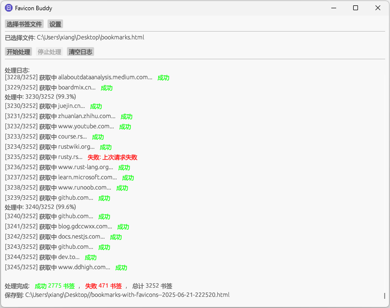

# browser-favicon-buddy

浏览器书签 favicon 加载工具。

## Translation

- [English](README-EN.md)

## 功能简介

- 批量加载书签文件中的网站 favicon
- 支持图形界面操作
- 跨平台：Linux、Windows、macOS

## 使用方法

按下面步骤使用：

1、通过浏览器书签管理导出"书签文件" (`.html` 格式)，Firefox/Chrome 通过快捷键 `Ctrl/Cmd + Shift + O` 进入书签管理；

2、使用 favicon-buddy 加载"书签文件"，执行"开始处理"，等待处理完成；

3、处理完成后，在原文件同一目录，生成处理之后的文件，文件名为 `<原文件名>-with-favicons--<当前时间>.html`

4、浏览器导入生成的书签文件。

## 注意事项

Chrome 导入书签文件：

- 很慢、很卡，需要等待很长时间。

Firefox 导入书签文件：

- "Bookmarks Toolbar" 会被导入至"Bookmarks Menu"中"，需要全选、剪切至"Bookmarks Toolbar"；
- "Bookmarks Menu" 中会追加原来的"Bookmarks Menu"中的书签，可能导致"Keyword"丢失。

## 截图

## 许可证

本项目采用 MIT 许可证，详见 [LICENSE](LICENSE)。
